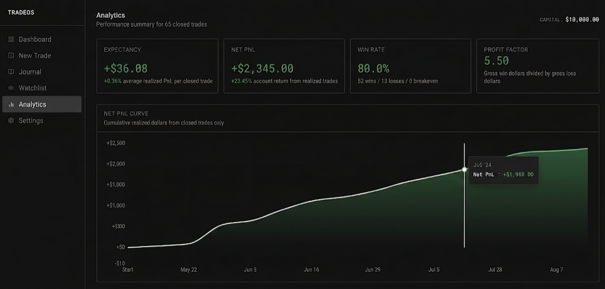

# Trading OS

A personal trading journal and analytics dashboard built to track trading performance, risk, and activity.

## Features

* Trade journaling
* PnL and performance tracking
* Risk management metrics
* Portfolio analytics
* Trading history

## Tech Stack

* Next.js
* TypeScript
* Supabase
* Vercel

> Built for personal use.
